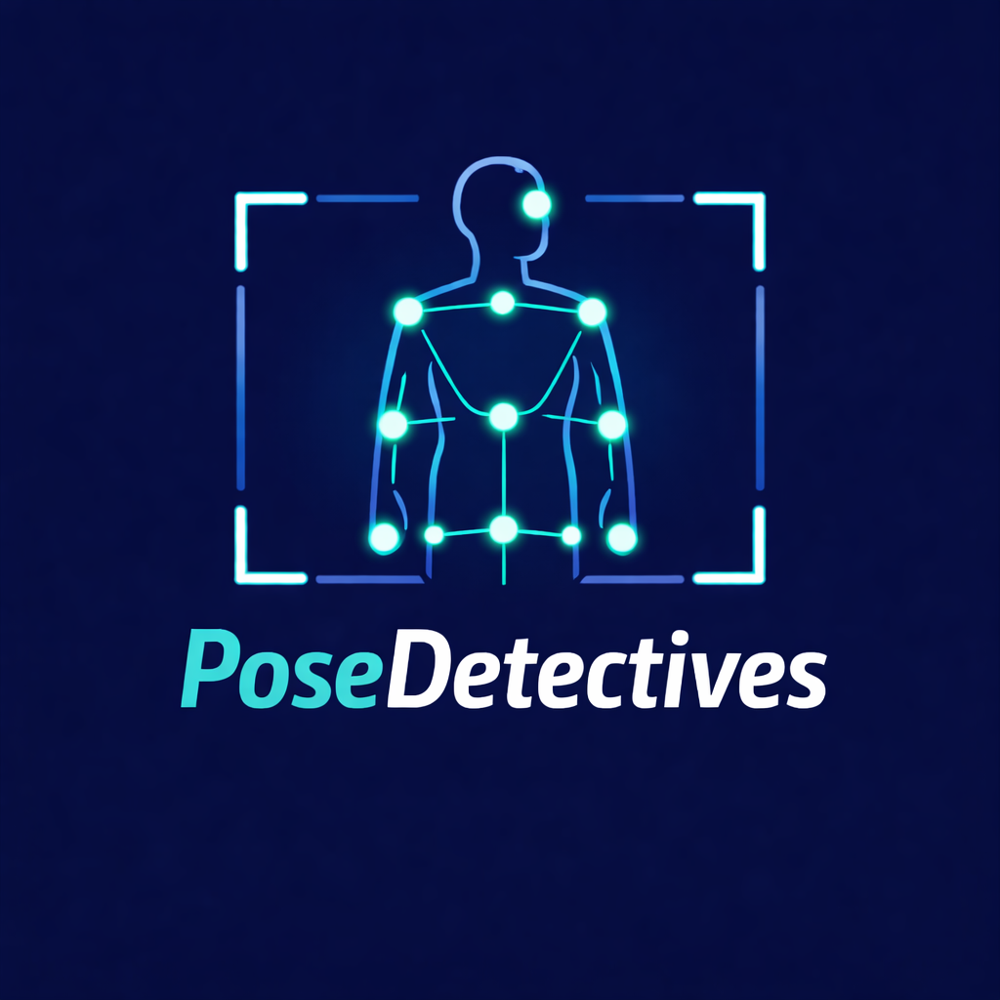
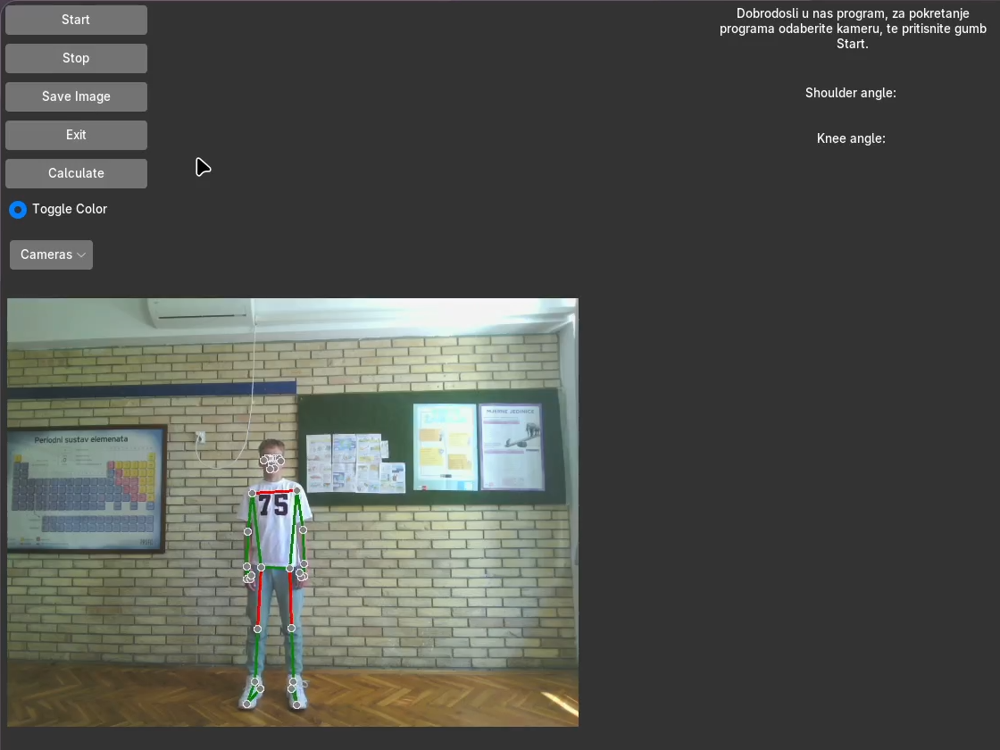
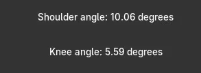

# 🧍 PoseDetectives



**Program za detekciju i analizu pravilnog držanja tijela u stvarnom vremenu**

PoseDetectives koristi računalni vid i MediaPipe za prepoznavanje ljudske poze, izračunavanje kutova između ključnih točaka tijela te procjenu kvalitete držanja.

---

## 📸 Sučelje programa

  


---

## 👨‍💻 Autori

- Bruno Čalić, 8.b, OŠ Vladimir Nazor, Čepin  
- Luka Beraković, 8.a, OŠ Vladimir Nazor, Čepin  

**Mentor:** Maja Jurić-Babaja  
**Vanjski mentor:** Vlatko Šaravanja  
**Školska godina:** 2025./2026.

---

## 🎯 Cilj projekta

Cilj projekta je osvijestiti problem nepravilnog držanja tijela kod učenika i mladih te omogućiti jednostavnu analizu držanja pomoću kamere i računalnog vida.

Program pomaže korisnicima da:
- prepoznaju nepravilno držanje
- dobiju povratnu informaciju u stvarnom vremenu
- spriječe zdravstvene probleme (bolovi u leđima, vratu itd.)

---

## ⚙️ Funkcionalnosti

- 🎥 Prikaz videoprijenosa u stvarnom vremenu  
- 📸 Fotografiranje trenutne poze  
- 🧠 Detekcija ključnih točaka tijela (MediaPipe)  
- 📐 Računanje kutova:
  - ramena  
  - kukova  
  - koljena  
- 📊 Analiza odstupanja od idealnog držanja  
- 🟢🔴 Vizualni prikaz točnosti (zeleno/crveno)  
- 💾 Spremanje slike trenutnog stanja  
- 📷 Odabir više kamera  
- 🖥️ Tkinter GUI (Azure theme)  

---

## 🧠 Kako program radi

1. Kamera hvata sliku u stvarnom vremenu  
2. MediaPipe detektira ključne točke tijela  
3. NumPy pretvara sliku u array  
4. Računaju se kutovi između vektora tijela  
5. Uspoređuju se s idealnim vrijednostima  
6. Program daje postotak i analizu držanja  

---

## 🧰 Korištene tehnologije

- Python 🐍 **3.11.9 (preporučeno)**  
- OpenCV **4.10.0.84**  
- MediaPipe **0.10.14**  
- NumPy **1.26.4**  
- Tkinter (ugrađen)  
- Math (ugrađen)  
- Azure-ttk-theme **latest**  

---

## 💻 Sistemski zahtjevi

- Python 3.11 ili stariji  
- CPU: 4+ jezgri (2.4 GHz+)  
- RAM: 8 GB+  
- Web kamera  
- 10–20 GB slobodnog prostora  

---

## 📦 Instalacija

### 1. Kloniraj repozitoriji i otvori exe datoteku u /dist zvanu main
### 2. Ako želite uređivati izvorni kod, klonirajte repozitorij i napravite fork, jer je to preporučeno
```bash
git clone https://github.com/tvoje-korisnicko-ime/PoseDetectives.git
cd PoseDetectives
